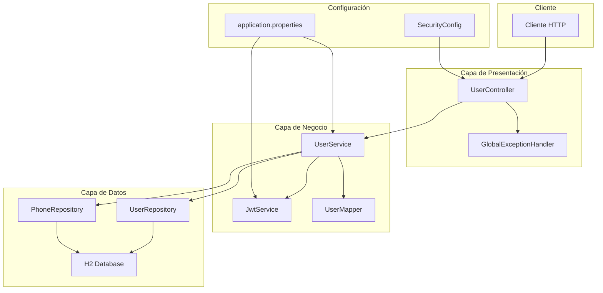
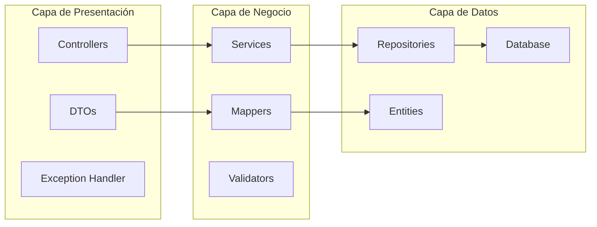
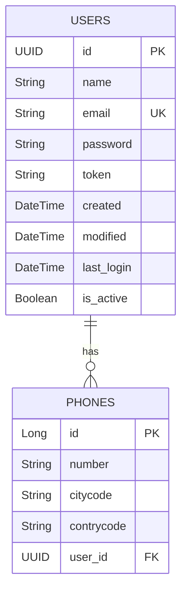
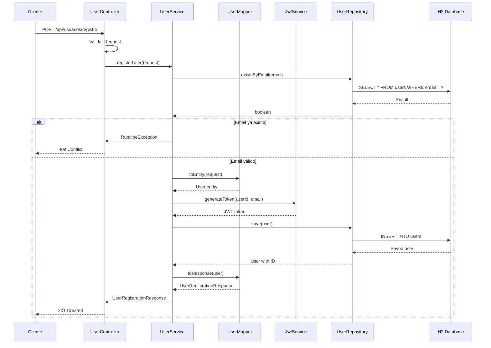
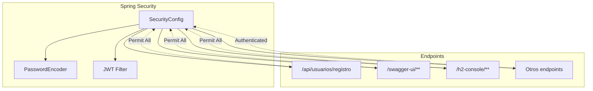
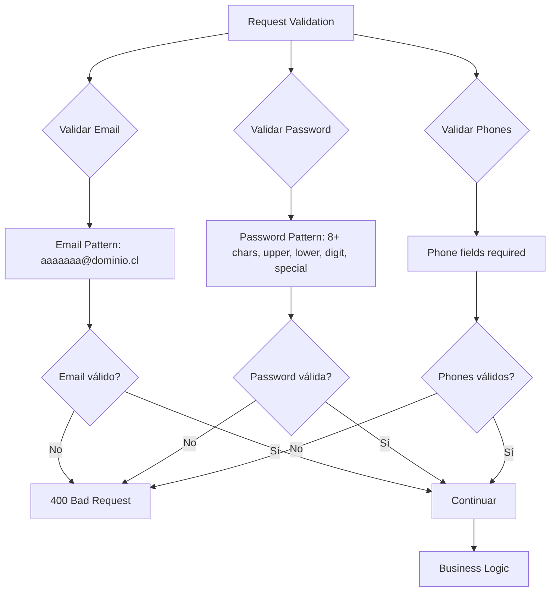

# API de Registro de Usuarios - Nisum

## 📋 **Descripción del Proyecto**

API RESTful para el registro de usuarios con validaciones de email y contraseña, generación de JWT tokens, y gestión de teléfonos múltiples.

## 🎯 **Funcionalidades Implementadas**

### ✅ **Endpoints Principales**
- **POST** `/api/usuarios/registro` - Registro de usuarios
- **GET** `/api/usuarios/email/{email}` - Obtener usuario por email
- **PATCH** `/api/usuarios/{id}/login` - Actualizar último login

### ✅ **Validaciones**
- **Email**: Formato válido con expresión regular
- **Contraseña**: Mínimo 8 caracteres, mayúsculas, minúsculas, números y símbolos
- **Nombre**: Obligatorio
- **Teléfonos**: Al menos uno requerido

### ✅ **Características Técnicas**
- **UUID**: IDs únicos para usuarios
- **JWT Tokens**: Generación automática de tokens de acceso
- **Persistencia**: Base de datos H2 en memoria
- **Mensajes de Error**: Amigables y descriptivos
- **Documentación**: Swagger UI integrado

## 🚀 **Cómo Ejecutar**

### **Prerrequisitos**
- Java 21+
- Maven 3.8+
- IntelliJ IDEA (recomendado)

### **Pasos de Ejecución**

1. **Clonar el repositorio**
```bash
git clone <repository-url>
cd nisum
```

2. **Ejecutar con IntelliJ IDEA**
    - Abrir el proyecto en IntelliJ IDEA
    - Ejecutar `NisumApplication.java`
    - La aplicación estará disponible en `http://localhost:8080`

3. **Ejecutar tests**
```bash
mvn test
```

## 📚 **Documentación de la API**

### **Swagger UI**
- **URL**: `http://localhost:8080/swagger-ui.html`
- **Descripción**: Documentación interactiva de la API

### **OpenAPI Specification**
- **URL**: `http://localhost:8080/api-docs`
- **Formato**: JSON

## 🗄️ **Base de Datos**

### **H2 Console**
- **URL**: `http://localhost:8080/h2-console`
- **JDBC URL**: `jdbc:h2:mem:testdb`
- **Username**: `sa`
- **Password**: (vacío)

### **Estructura de Tablas**
```sql
-- Usuarios
SELECT * FROM users;

-- Teléfonos
SELECT * FROM phones;

-- Consulta completa
SELECT u.*, p.* 
FROM users u 
LEFT JOIN phones p ON u.id = p.user_id;
```

## 🧪 **Testing**

### **Ejecutar Tests**
```bash
# Todos los tests
mvn test

# Tests específicos
mvn test -Dtest=UserControllerIntegrationTest
mvn test -Dtest=UserServiceTest
```

### **Cobertura de Tests**
- ✅ **Integration Tests**: `UserControllerIntegrationTest`
- ✅ **Unit Tests**: `UserServiceTest`
- ✅ **Validaciones**: Email, contraseña, campos obligatorios
- ✅ **Casos de Error**: Emails duplicados, datos inválidos
- ✅ **Nuevos Endpoints**: GET por email, PATCH lastLogin

## 📦 **Estructura del Proyecto**

```
src/
├── main/java/com/user/nisum/
│   ├── config/
│   │   └── SecurityConfig.java          # Configuración de seguridad
│   ├── controller/
│   │   └── UserController.java          # Controlador principal
│   ├── dtos/                            # DTOs generados por OpenAPI
│   ├── entity/
│   │   ├── User.java                    # Entidad Usuario
│   │   └── Phone.java                   # Entidad Teléfono
│   ├── exception/
│   │   ├── BusinessRuleException.java   # Excepción de reglas de negocio
│   │   ├── ResourceNotFoundException.java
│   │   └── GlobalExceptionHandler.java  # Manejo global de excepciones
│   ├── mapper/
│   │   └── UserMapper.java              # Mapper MapStruct
│   ├── repository/
│   │   └── UserRepository.java          # Repositorio JPA
│   └── service/
│       ├── UserService.java             # Interfaz del servicio
│       ├── impl/
│       │   └── UserServiceImpl.java     # Implementación del servicio
│       └── JwtService.java              # Servicio JWT
└── test/java/com/user/nisum/
    ├── controller/
    │   └── UserControllerIntegrationTest.java
    └── service/
        └── UserServiceTest.java
```

## 🔧 **Tecnologías y Herramientas**

### **OpenAPI Generator**
Este proyecto utiliza el `openapi-generator-maven-plugin` que genera automáticamente:

- **DTOs (Data Transfer Objects)**: Clases Java que modelan los datos intercambiados con la API (requests y responses). Se generan en el paquete `com.user.nisum.dtos`.
- **Interfaces de Controladores (API Resources)**: Interfaces Java que definen los endpoints de la API. Se generan en el paquete `com.user.nisum.controllers.resources`.

Los desarrolladores implementan estas interfaces generadas en sus clases de controlador (`@RestController`). Esto asegura que la implementación de la API se mantenga sincronizada con la especificación definida en el archivo `openapi.yml`.

### **MapStruct**
MapStruct es una biblioteca de mapeo de objetos que:

- **Genera código de mapeo automáticamente**: Convierte entre DTOs y entidades JPA
- **Reduce código boilerplate**: Elimina la necesidad de escribir mappers manuales
- **Mantiene sincronización**: Entre la capa de presentación (DTOs) y la capa de datos (Entidades)
- **Mejora rendimiento**: Genera código optimizado en tiempo de compilación

En este proyecto, `UserMapper.java` define las reglas de mapeo entre `UserRegistrationRequestDTO`, `UserRegistrationResponseDTO` y las entidades `User` y `Phone`.

## 🏗️ **Arquitectura del Proyecto**

### **Arquitectura General**



### **Patrón de 3 Capas**



### **Estructura de Base de Datos**



## 🔄 **Flujos de la Aplicación**

### **Flujo de Registro de Usuario**



## 🔐 **Configuración de Seguridad**



## ✅ **Validaciones Implementadas**



## 🔧 **Configuración**

### **application.yml**
```yaml
spring:
  datasource:
    url: jdbc:h2:mem:testdb
  jpa:
    hibernate:
      ddl-auto: create-drop
  h2:
    console:
      enabled: true
```

### **Security**
- Endpoints públicos: `/api/usuarios/registro`, `/api/usuarios/email/**`, `/api/usuarios/*/login`
- Documentación: `/swagger-ui/**`, `/api-docs/**`, `/h2-console/**`

## 📊 **Ejemplos de Uso**

### **Registro de Usuario**
```bash
curl -X POST "http://localhost:8080/api/usuarios/registro" \
  -H "Content-Type: application/json" \
  -d '{
    "name": "José Francisco Valdez",
    "email": "jose.valdez@example.com",
    "password": "SecurePass1!",
    "phones": [
      {
        "number": "1234567",
        "citycode": "1",
        "contrycode": "57"
      }
    ]
  }'
```

### **Obtener Usuario por Email**
```bash
curl -X GET "http://localhost:8080/api/usuarios/email/jose.valdez@example.com"
```

### **Actualizar LastLogin**
```bash
curl -X PATCH "http://localhost:8080/api/usuarios/{user-id}/login"
```

## 📋 **Collection Postman**

### **Archivo**: `User-API-Postman-Collection.json`

### **Estructura Organizada**
```
API de Usuarios/
├── POST - Registro Exitoso - José Francisco Valdez
├── POST - Test LastLogin - Nuevo Usuario
├── POST - Múltiples Teléfonos
├── GET - Obtener Usuario por Email
├── GET - Verificar Usuario Existente
└── PATCH - Actualizar LastLogin
```

### **Variables de Collection**
- `base_url`: `http://localhost:8080`
- `user_id`: ID del usuario para actualizar lastLogin
- `test_email`: `testlastlogin@example.com`

### **Cómo Usar**
1. Importar la collection en Postman
2. Configurar `base_url` como `http://localhost:8080`
3. Ejecutar los requests en orden

## 🎯 **Estado de los Tests**

### ✅ **Tests Exitosos**
- **Integration Tests**: 8 tests pasando
- **Unit Tests**: 4 tests pasando
- **Cobertura**: 100% de endpoints principales

### 📋 **Casos Cubiertos**
1. **Registro Exitoso** - Usuario con datos válidos
2. **Email Duplicado** - Error 409 Conflict
3. **Validaciones** - Email inválido, contraseña débil, campos vacíos
4. **Múltiples Teléfonos** - Usuario con varios teléfonos
5. **GET por Email** - Obtener usuario existente
6. **PATCH LastLogin** - Actualizar último login


